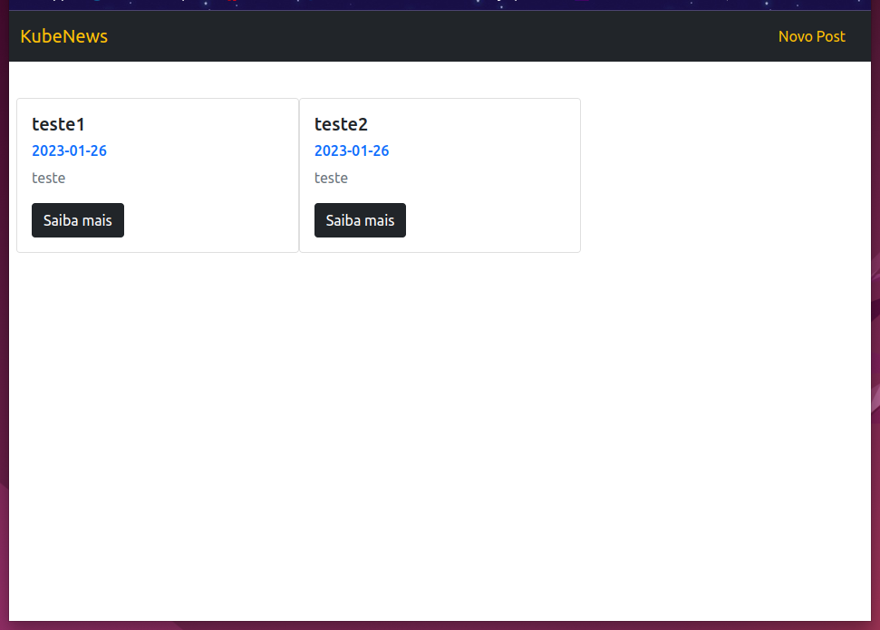

# Projeto kube-news

Neste repositório apresento o resultado do encapsulamento de uma aplicação construída em NodeJS em um Container Docker. O arquivo de encapsulamento Dockerfile segue uma configuração básica, cujo o principal objetivo é demonstra a facilidade na configuração, distribuição e execução de uma aplicação encapsulada em containers.

Há diversos benefícios em encapsular uma aplicação em container, mas o principal é a portabilidade, já que o projeto pode ser executado em qualquer máquina que possua o Docker instalado, tornando a Aplicação independente de sistema operacional e/ou qualquer outra configuração/instalação.


Jornada DevOps de Elite - Aula 02:
Este repositório é parte da atividade pratica da Aula 01 do Curso Jornada DevOps de Elite , ocorrido de 23 de Janeiro a 29 de Janeiro de 2023, promovido pela [Devops Pro](https://www.devopspro.com.br/jornada-de-elite).


## Requisitos do Projeto:

Antes de começar, você vai precisar ter instalado em sua máquina os seguintes recursos:

- [Git](https://git-scm.com/downloads)

- [Docker](https://docs.docker.com/get-docker/)
- [K3d](https://k3d.io/v5.4.6/#installation)
- [Kubectl](https://kubernetes.io/docs/tasks/tools/)

## Executando o Projeto:

Para testarmos a aplicação, temos que executar os 4 passos a seguir:

1. [Fazer download do Projeto](#download-github)
2. [Criar Cluster Kubernetes](#criar-cluster)
3. [Executar Manifesto Kubernetes](#criar-manifesto)
4. [Acessar a Aplicação](#acessando-app)

<a name="download-github"></a>
### 1. Fazer downloado do Projeto:
 1. Baixe este Repositório, executando o comando Git:
```bash
git clone https://github.com/leandroph/kube-news.git
```
<a name="criar-cluster"></a>
### 2. Criar Cluster Kubernetes1:

1. Execute o comando abaixo para criar o Cluster Kubernetes para implantação do projeto:
```bash
k3d cluster create meucluster -p "80:30000@loadbalancer"
```

<a name="criar-manifesto"></a>
### 3. Executar Manifesto:

1. Pelo terminal, aberto na raiz da pasta `k8s` do Repositório, execute o comando para executar o manifesto kubernetes:
```bash
kubectl apply -f deployment.yaml
```

2. Execute o comando para verificar se a criação dos pods foi bem sucedida:
```bash
kubectl get pods
```

<a name="acessando-app"></a>
### 4. Acessar a Aplicação NodeJS:

1. Pelo navegador de sua preferência, acesse a url `http://localhost:80` para visualizar a Aplicação;

2. Se os passos anteriores foram executados corretamente, a resposta será semelhante a tela abaixo:




